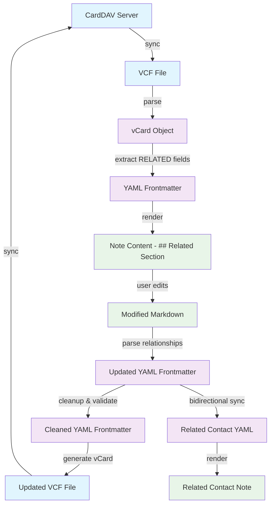

# vCard 4.0 RELATED Field Data Flow Pipeline

This document describes the complete data flow pipeline for vCard 4.0 RELATED fields, from CardDAV synchronization through VCF files, YAML frontmatter, note content, and back again.

## Data Flow Architecture



## Data Transformation Details

### 1. CardDAV → VCF
- **Source**: CardDAV server (external contact management system)
- **Format**: Network protocol with vCard data
- **Destination**: Local VCF file

### 2. VCF → vCard Object
- **Parser**: `src/contacts/vcard/parse.ts`
- **Process**: Parse VCF text into structured vCard object
- **RELATED Field Format**: `RELATED;TYPE=friend:urn:uuid:12345-abcde` or `RELATED;TYPE=friend:name:ContactName`

### 3. vCard Object → YAML Frontmatter
- **Transformer**: `src/contacts/vcard/shared/vcard.d.ts`
- **Process**: Extract RELATED fields and convert to indexed YAML format
- **YAML Format**: 
  ```yaml
  RELATED[friend]: urn:uuid:12345-abcde
  RELATED[1:parent]: urn:uuid:67890-fghij
  RELATED[child]: name:Tommy Smith
  ```

### 4. YAML Frontmatter → Note Content
- **Renderer**: `src/contacts/relationshipManager.ts#renderRelationshipsMarkdown()`
- **Process**: Convert frontmatter RELATED fields to human-readable markdown
- **Markdown Format**:
  ```markdown
  ## Related
  
  - Friend [[Jane Smith]]
  - Parent [[Bob Johnson]]
  - Child [[Tommy Smith]]
  ```

### 5. Note Content → Modified Markdown (User Interaction)
- **Interface**: User edits the `## Related` section directly in Obsidian
- **Flexibility**: Header can appear at any level (`#`, `##`, `###`, etc.) and any position in the note
- **Syntax**: Simple format `- RelationshipType [[ContactName]]`

### 6. Modified Markdown → Updated YAML Frontmatter
- **Parser**: `src/contacts/relationships.ts#parseRelationshipMarkdown()`
- **Sync Service**: `src/contacts/relationshipSyncService.ts`
- **Process**: Parse markdown relationships back to YAML frontmatter format
- **Validation**: 
  - Check for duplicate relationships (same URI + relationship type)
  - Convert contact names to UIDs when possible
  - Use name-based format for missing contacts

### 7. YAML Validation & Cleanup
- **Cleaner**: `src/contacts/relationshipManager.ts#cleanupEmptyRelatedFields()`
- **Process**: 
  - Remove empty RELATED fields
  - Prevent duplicate entries
  - Upgrade name-based to UID-based when contacts are created
- **Rules**:
  - Same URI can appear in multiple RELATED entries but relationship type must be different
  - Empty values are automatically removed

### 8. YAML Frontmatter → Updated VCF File
- **Generator**: `src/contacts/vcard/toString.ts`
- **Process**: Convert YAML frontmatter back to vCard format
- **vCard Output**: 
  ```vcf
  BEGIN:VCARD
  VERSION:4.0
  FN:John Smith
  RELATED;TYPE=friend:urn:uuid:12345-abcde
  RELATED;TYPE=parent:urn:uuid:67890-fghij
  RELATED;TYPE=child:name:Tommy Smith
  END:VCARD
  ```

### 9. Updated VCF → CardDAV Server
- **Sync**: VCF watcher service uploads changes back to CardDAV server
- **Completion**: Full round-trip sync maintains data consistency

## Bidirectional Relationship Sync

When a relationship is added/removed, the system automatically:

1. **Updates Source Contact**: Modifies the contact where the user made the change
2. **Finds Target Contact**: Locates the related contact by UID or name
3. **Updates Target Contact**: 
   - Updates target contact's YAML frontmatter with complement relationship
   - Re-renders target contact's `## Related` section
   - Applies same cleanup and validation rules

### Relationship Type Mapping

| Source Type | Target Type | Relationship |
|-------------|-------------|--------------|
| parent      | child       | Asymmetric   |
| child       | parent      | Asymmetric   |
| spouse      | spouse      | Symmetric    |
| friend      | friend      | Symmetric    |
| manager     | subordinate | Asymmetric   |
| subordinate | manager     | Asymmetric   |

## Event Triggers

### File Open Event
- **Trigger**: User opens a contact note
- **Action**: Sync frontmatter → note content (ensure markdown is up to date)

### File Modification Event  
- **Trigger**: User modifies note content
- **Action**: Mark file for sync (debounced)

### Active Leaf Change Event
- **Trigger**: User switches away from a contact note
- **Action**: Sync note content → frontmatter (preserve user edits)

### Manual Refresh Command
- **Trigger**: User executes "Refresh Current Contact Relationships"
- **Action**: Full bidirectional sync with re-rendering

## Data Integrity Rules

1. **UID Consistency**: UIDs are immutable identifiers that survive contact name changes
2. **Relationship Complement**: All relationships automatically create their complement
3. **Duplicate Prevention**: Same URI + relationship type combinations are prevented
4. **Empty Field Cleanup**: Empty RELATED fields are automatically removed
5. **Name → UID Upgrade**: Name-based relationships are upgraded to UID-based when possible
6. **Case Insensitive**: All relationship types and headers accept any case but render consistently
7. **Header Flexibility**: `Related` header can appear at any level and position in the note

This architecture ensures robust, bidirectional synchronization while maintaining vCard 4.0 standard compliance and providing an intuitive user experience in Obsidian.