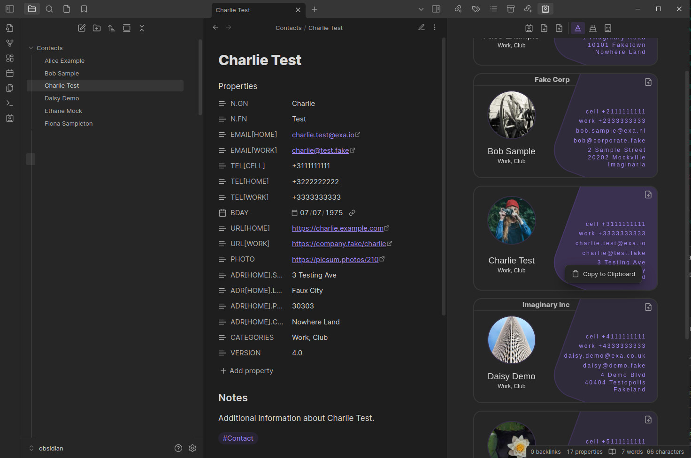
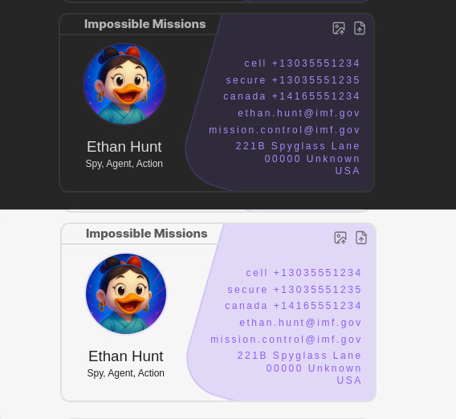

# VCF Contacts Plugin for Obsidian
Introducing the [Obsidian](https://obsidian.md/) Contacts Plugin! With this plugin, you can easily organize and manage your contacts within [Obsidian](https://obsidian.md/). Simply create a note within the contacts folder and use the plugin's features to quickly add to, search, link and sort through your contacts. Contacts plugin also helps you to organize, import, and export to for example email clients or google contacts, remember birthdays and more.



📌 Installation

🔄 Automatic (Community Plugins)

    Open Obsidian Settings → Community Plugins
    Disable Safe Mode if enabled
    Click Browse, search for "VCF Contacts"
    Click Install and then Enable

📥 Manual Installation

    Download from github main.js, manifest.json, and styles.css from the Releases.
    Create a folder in your Obsidian vault:
    📂 <VaultFolder>/.obsidian/plugins/obsidian-vcf-contacts
    Move the downloaded files into this folder.
    Restart Obsidian and enable the plugin in Settings → Community Plugins.

🚀 Usage

Once enabled, the plugin allows you to import, export, and manage contacts within Obsidian.
🔹 Before You Start: Set Up a Contacts Folder

To keep your contacts organized, create a dedicated contacts folder and set it in the plugin settings:

    Open Settings in Obsidian.
    Navigate to the Contacts tab.
    Set "Contacts Folder Location" to an existing folder.

📥 Importing a vCard or Contact Database

    Open the Contacts sidebar from the left main dock.
    The Contacts plugin interface will appear, displaying the main functions at the top.
    Click "Import VCF" and load your .vcf file (single or database).
    If your contact data is inconsistent (which is common 😉), you'll be prompted to enter:
        Given Name (First Name)
        Family Name (Last Name)
        These fields are required, as they are used as the main identifier within the plugin.

📤 Exporting a vCard

    Click the "Export VCF" button in the Contacts plugin interface or on a single contact.
    Choose where to save the .vcf file.
    The file will be generated in vCard 4.0 format.

🖼️ Importing Avatars

You can add avatars to your contacts in two ways:

    From a Local File: Press process avatar button. Select an image file (e.g. .jpg, .png).
    From a URL: Paste in the image URL directly in the PHOTO property and then press process avatar button. 

    The process avatar button will minimize, scale and include the avatars to obsidion Vault-Local Storage 

📞 Click-to-Call & Quick Copy

    Click on a phone number or email address to initiate a call or open your email client.
    Right-click on any displayed property and select "Copy to Clipboard" to quickly copy the value.

➕ Creating a New Contact from Scratch

    Click the "Create Contact" button in the Contacts plugin interface.
    Enter Given Name and Family Name (required).
    Add additional contact details (phone, email, address, etc. etc.).
    Your contact is now saved in Obsidian and can be exported as a .vcf file when needed.
    Feel free to add more data as long as they match with the VCF schema patterns.
    It's just another obsidian markdown file so link, write as you prefer.


🔎 Searching for Contacts

If you, like me, have more than a thousand contacts, a quick search is essential. Fortunately, Obsidian’s Quick Switcher makes finding contacts instant and effortless.

🔹 Using the Quick Switcher

    Press Ctrl + O (Windows/Linux) or Cmd + O (Mac).
    Start typing a part of the contact’s name.
    Select the contact from the list and press Enter to open it.
    The contacts overview will automatically scroll to the selected contact card.

This method ensures that you can quickly navigate to any contact without manually searching through your files. 🚀

# 📖 Understanding the vCard (VCF) Format

The **vCard (VCF) format** is a widely used **standard for storing and exchanging contact information**. It allows for structured data, including names, phone numbers, email addresses, profile photos, and more.

For an in-depth explanation, refer to the **official vCard 4.0 specification**:  
📜 **[RFC 6350](https://datatracker.ietf.org/doc/html/rfc6350)**

---

## 📌 Example vCard Entry (Foo Bar)

Here’s an example vCard entry for **Foo Bar**, demonstrating **fake yet recognizable data**:



```markdown
---
N.GN: Foo  # Given Name (First Name)
N.FN: Bar  # Family Name (Last Name)
EMAIL[HOME]: "foo.bar@example.com"  # Personal Email
EMAIL[WORK]: "foo.bar@corporate.fake"  # Work Email
TEL[CELL]: "+1234567890"  # Mobile Phone
TEL[HOME]: "+1987654321"  # Home Phone
TEL[WORK]: "+1098765432"  # Work Phone
BDAY: "1985-12-31"  # Birthday (YYYY-MM-DD)
URL[HOME]: "https://foobar.example.com"  # Personal Website
URL[WORK]: "https://company.fake/foobar"  # Work Website
PHOTO: "https://picsum.photos/200"  # Profile Picture URL
ADR[HOME].STREET: "123 Fake Street"  # Home Address - Street
ADR[HOME].LOCALITY: "Faketown"  # Home Address - City
ADR[HOME].POSTAL: "00000"  # Home Address - Postal Code
ADR[HOME].COUNTRY: "Nowhere Land"  # Home Address - Country
CATEGORIES: "Work, Club"  # Contact Categories
VERSION: "4.0"  # vCard Format Version
---
#### Notes  
Additional information about Foo Bar.

#Contact
```

---

## 📌 Supported vCard Fields

Below are just a few of the supported vCard fields and their **human-readable descriptions** .

### 📞 Basic Contact Information
| **vCard Field** | **Readable Name** | **Format Example**        |
|---------------|----------------|---------------------------|
| `VERSION` | vCard Version | `4.0`                     |
| `N.PREFIX` | Name Prefix (e.g., Mr., Dr.) | `Dr.`                     |
| `N.GN` | Given Name (First Name) | `Foo`                     |
| `N.MN` | Middle Name | `Middleton`               |
| `N.FN` | Family Name (Last Name) | `Bar`                     |
| `N.SUFFIX` | Name Suffix (e.g., Jr., Sr., III) | `Jr.`                     |
| `FN` | Full Name | `Foo Bar`                 |
| `NICKNAME` | Nickname | `Foobar`                  |
| `EMAIL[HOME]` | Personal Email | `foo.bar@example.com`     |
| `EMAIL[WORK]` | Work Email | `foo.bar@corporate.fake`  |
| `TEL[CELL]` | Mobile Phone Number | `+1234567890`             |
| `TEL[HOME]` | Home Phone Number | `+1987654321`             |
| `TEL[WORK]` | Work Phone Number | `+1098765432`             |
| `BDAY` | Birthday Date | `1985-12-31` (YYYY-MM-DD) |
| `GENDER` | Gender | `M` / `F` / `X`           |
| `ORG` | Organization Name | `FakeCorp Inc.`           |
| `TITLE` | Job Title | `Senior Developer`        |
| `ROLE` | Job Role | `Software Engineer`       |

---

### 🏠 Address Fields
| **vCard Field** | **Readable Name** | **Format Example** |
|---------------|----------------|----------------------|
| `ADR[HOME].STREET` | Home Address - Street | `123 Fake Street` |
| `ADR[HOME].LOCALITY` | Home Address - City | `Faketown` |
| `ADR[HOME].REGION` | Home Address - State/Province | `FakeState` |
| `ADR[HOME].POSTAL` | Home Address - Postal Code | `00000` |
| `ADR[HOME].COUNTRY` | Home Address - Country | `Nowhere Land` |
| `ADR[WORK].STREET` | Work Address - Street | `789 Corporate Ave` |
| `ADR[WORK].LOCALITY` | Work Address - City | `Business City` |
| `ADR[WORK].REGION` | Work Address - State/Province | `IndustryState` |
| `ADR[WORK].POSTAL` | Work Address - Postal Code | `99999` |
| `ADR[WORK].COUNTRY` | Work Address - Country | `Enterprise Land` |

---

### 🌐 Online Presence
| **vCard Field** | **Readable Name** | **Format Example** |
|---------------|----------------|----------------------|
| `URL[HOME]` | Personal Website URL | `https://foobar.example.com` |
| `URL[WORK]` | Work Website URL | `https://company.fake/foobar` |
| `SOCIALPROFILE[facebook]` | Facebook Profile | `https://facebook.com/foobar` |
| `SOCIALPROFILE[twitter]` | Twitter Profile | `https://twitter.com/foobar` |
| `SOCIALPROFILE[linkedin]` | LinkedIn Profile | `https://linkedin.com/in/foobar` |
---

### 🖼️ Profile Photo
| **vCard Field** | **Readable Name** | **Format Example** |
|---------------|----------------|----------------------|
| `PHOTO` | Profile Picture URL | `https://example.com/photos/foo-bar.jpg` |

---

### 🗂️ Categorization & Metadata
| **vCard Field** | **Readable Name** | **Format Example** |
|---------------|----------------|----------------------|
| `CATEGORIES` | Categories (Tags) | `Work, Friends` |
| `CLASS` | Classification (Privacy Level) | `public` / `private` |
| `REV` | Last Updated Timestamp | `20240312T123456Z` (ISO 8601) |
| `SOURCE` | vCard Source URL | `https://example.com/foo-bar.vcf` |
| `UID` | Unique Identifier | `foo-bar-uuid-1234` |

---

## 🚀 Why This Format and Why a Plugin for Obsidian.

For many of us, using Obsidian is like brewing a perfect cup of coffee—it kick-starts our productivity and fills our day with energy. Linking up the Obsidian knowledge vault with the people we meet or work with was always a pain point for me. To be honest, contact databases never seem to sync up as I want them to!

✔ **vCard 4.0 ensures your contacts are as tidy as your favorite playlist.**  
✔ **Effortlessly import/export contacts, making transitions smoother than your morning routine.**  
✔ **Fully supports major vCard fields for a contact experience that's both fun and functional.**  
✔ **Link up your knowledge vault with something extremely important: the people in our lives.**  
✔ **Add a dash of joy to your everyday workflow—because organization brings productivity and happy routines!**

Wishing you an inspiring journey with your enhanced contact experience. ** Start using the plugin today and share your thoughts in the [community comments](https://github.com/broekema41/obsidian-vcf-contacts/discussions)!**

🙏 Acknowledgements

This plugin was originally inspired by and started as a fork of Vadim Beskrovnov’s Contacts plugin. You probably wouldn’t recognize it from the current codebase anymore—but still, huge thanks to Vadim for laying a solid foundation to explore, experiment with, and be inspired by.
